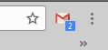

# gmaillabel

Плагин для chrome, который показывает количество непрочитанных писем для созданных Вами ярлыков в gmail



Установка:

```
#!bash

git clone https://github.com/alexcomin/gmaillabel.git

```

После нужно отредактировать файл gmailtag.py, а именно ввести свой логин и пароль от почты и имя ярлыка и сохранить скрипт

Далее:


```
#!bash

cd gmaillabel

python3 gmailtag.py &

```

После этого делаем так

```
#!bash

sudo vim /etc/crontab

#Добавляем следующую строку и сохраняем файл /etc/crontab

@reboot root sleep 180 && cd /home/user/gmaillabel/ && python3 gmailtag.py &

```

Далее открываем браузер и переходим в расширения и включаем режим разработчика

Нажимаем на кнопу "Загрузить распакованное расширение" и выбираем в обозревателе нашу папку gmaillabel

Плагин начнет свою работу.
